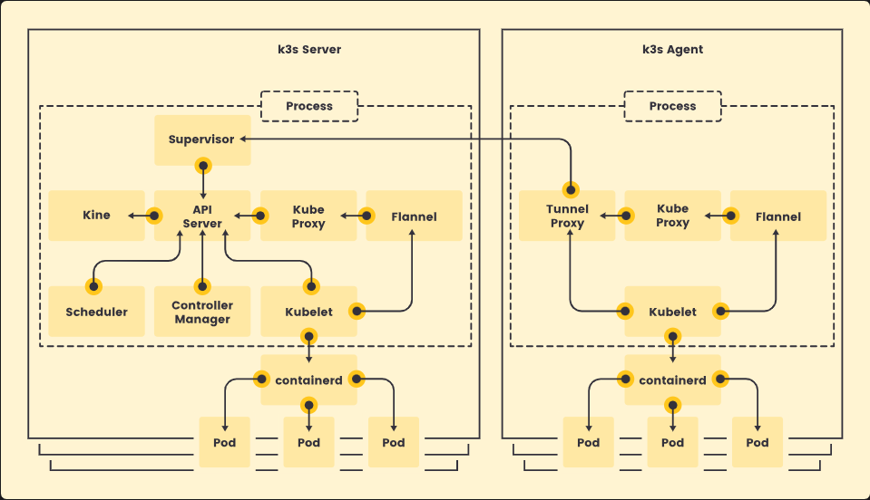
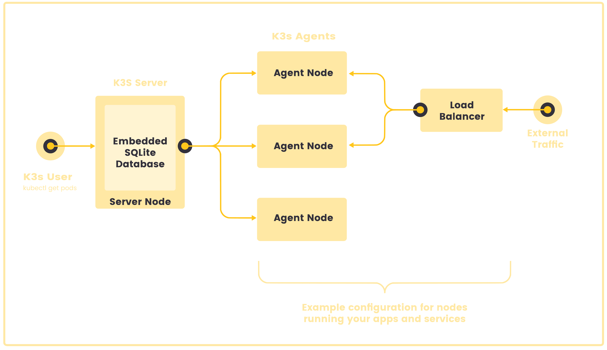

# Обзор k3s: Легковесный Kubernetes

https://k3s.io/
https://www.rancher.com/products/k3s

## 1. Введение в k3s

- **Что такое k3s**: Это легковесный дистрибутив Kubernetes, предназначенный для упрощенной настройки и управления
  кластерами, особенно для разработчиков. Идеален для использования в менее сложных и ресурсоёмких средах.
- **Преимущества**: Быстрая установка, простота настройки и оптимизация для работы в ограниченных ресурсах.

## 2. Преимущества k3s

- **Полная совместимость с Kubernetes**: k3s сертифицирован Cloud Native Computing Foundation и полностью совместим с
  Kubernetes.
- **Оптимизация**: Исключение ненужных компонентов из стандартной версии Kubernetes, что уменьшает потребление ресурсов.
- **Единственный бинарник**: Все компоненты Kubernetes (API сервер, контроллеры, планировщик и другие) собраны в одном
  бинарнике, что упрощает установку и обслуживание.

## 3. Архитектура k3s

### Компоненты:

- **k3s сервер (контроллер)**: Основной компонент, управляющий кластером и контролирующий все операции.
- **k3s агент (работник)**: Рабочие узлы, выполняющие приложения и контейнеры.

### Состав кластера:

- **API сервер** — управляет запросами.
- **Контроллер менеджер** — следит за состоянием ресурсов.
- **Планировщик** — распределяет задачи по узлам.
- **Кублет (kubelet)** — следит за состоянием контейнеров на узлах.
- **Сетевые драйверы** — используются для организации сетевого взаимодействия.

### Сетевой драйвер Flannel:

- По умолчанию используется для небольших кластеров и обеспечивает нужные сетевые функции.

### Хранение данных:

- Возможность использования различных баз данных, таких как SQLite или PostgreSQL.

## 4. Установка и настройка

- **Простота установки**: Для установки k3s требуется всего одна команда, что делает его доступным даже для новичков.
- **Ресурсные требования**: Минимальные требования — 512 МБ оперативной памяти и 1 процессор.
- **Поддержка операционных систем**: Работает на различных Linux-дистрибутивах, включая Alpine Linux, Red Hat и другие.
- **Уникальные имена серверов**: Для правильной работы каждого узла кластера необходимо, чтобы у них были уникальные
  имена.

## 5. Сценарии использования

- **Одноузловая установка**: Подходит для разработки и тестирования, когда все компоненты находятся на одном сервере.
- **Многоузловая установка**: Для отказоустойчивости и масштабируемости можно подключать дополнительные рабочие узлы.
- **Базы данных**: Возможность использования встроенной или внешней базы данных для хранения данных кластера (например,
  SQLite или PostgreSQL).

## 6. Конфигурация и управление

- **Гибкость установки**: Установка может быть настроена через переменные окружения или параметры командной строки, что
  позволяет адаптировать процесс под специфические требования.
- **Сетевые настройки**: Возможность настройки сетевых интерфейсов и диапазонов IP-адресов для внутренней сети кластера.
- **Минимальные требования к железу**: Рекомендуется использование SSD для хранения данных и минимальные требования к
  оперативной памяти и процессорам.

## 7. Дополнительные возможности

- **Развертывание и управление**: Гибкость в настройке, включая использование различных баз данных и настройку путей
  хранения данных.
- **Отказоустойчивость**: Для больших кластеров рекомендуется использование внешнего базового сервера и настройка
  отказоустойчивости (например, 3 и более серверов для обеспечения стабильности).

## Архитектура

### Серверы и агенты

Серверный узел - это узел, на котором запущена команда k3s server, а компоненты плоскости управления и хранилища данных
управляются K3s.
Под узлом агента понимается узел, на котором запущена команда k3s agent, без каких-либо компонентов хранилища данных или
плоскости управления.
И серверы, и агенты запускают kubelet, среду выполнения контейнеров и CNI. Дополнительные сведения о запуске серверов
без агентов см. в документации «Дополнительные параметры».

### Односерверная установка со встроенной базой данных

На следующей схеме показан пример кластера, в котором имеется одноузловой сервер K3s со встроенной базой данных SQLite.

В этой конфигурации каждый агентский узел зарегистрирован на одном серверном узле. Пользователь K3s может манипулировать
ресурсами Kubernetes, вызывая K3s API на серверном узле.

## Заключение

k3s — это идеальное решение для разработчиков, которым требуется простой и эффективный способ развертывания Kubernetes в
ограниченных ресурсах.
